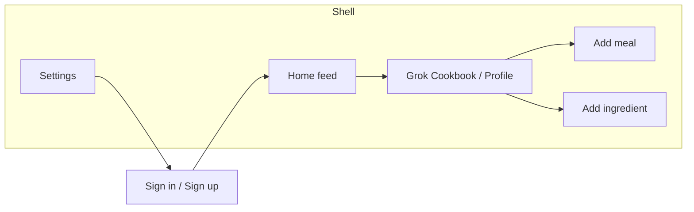
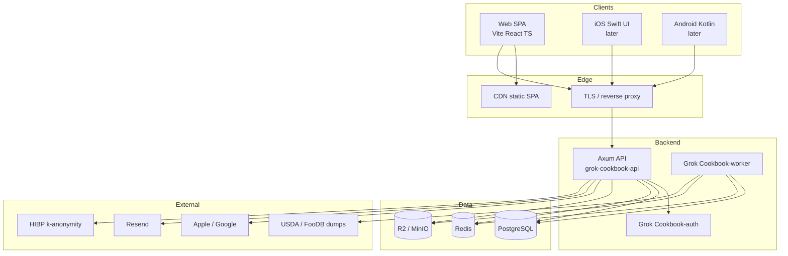
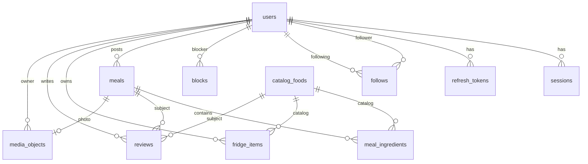
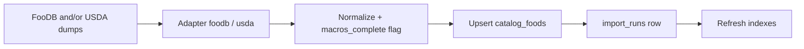

# Grok Cookbook — Product & System Design

| Field | Value |
|-------|-------|
| **Document** | Full product & system design |
| **Product** | Grok Cookbook |
| **Author** | _(TBD)_ |
| **Date** | 2026-07-25 |
| **Status** | **Approved for M0–M1** (rev 4 — user decisions 2026-07-25) |
| **Audience** | Senior engineers implementing from greenfield |

---

## Overview

Grok Cookbook is a social-media-style chef app: every user is a chef who follows other chefs, logs cooked and want-to-cook meals, manages a live fridge of catalog-backed ingredients, and writes reviews for meals and ingredients. Core surfaces map 1:1 from the existing static design system at `C:\Users\bjenn\Grok Cookbook\design\` (X-style ~600px centered feed, warm gold `#e8a54b` on charcoal, desktop side nav + mobile bottom tab bar): **Home**, **Grok Cookbook/Profile**, **Add meal**, **Add ingredient**, **Settings**, and **Auth**.

This design specifies a **Rust + Postgres backend as the single source of truth**, an **OpenAPI-first HTTP API**, and a **thin web UI first**. Native iOS/Android clients are **deferred indefinitely** until product retention is proven (user decision 2026-07-25); architecture still keeps the API multi-client-ready. Features ship incrementally—one vertical slice at a time.

**Catalog:** **FooDB-primary** for development and early product (user will obtain commercial license before public commercial launch). **USDA FDC** remains the free CI/macro fallback. See [Catalog & macros strategy](#catalog--macros-strategy) for licensing nuance (CC BY-NC vs commercial).

---

## Background & Motivation

### Current state

- **Greenfield application**: no existing backend, frontend, or infra codebase.
- **UI prototypes only**: static HTML/CSS under `C:\Users\bjenn\Grok Cookbook\design\` (`index.html`, `auth.html`, `auth-signup.html`, `Grok Cookbook.html`, `add-meal.html`, `add-ingredient.html`, `settings.html`, `styles.css`).
- Design tokens and shell already encode product IA: left nav / center feed / right rail on desktop; bottom tabs under 640px; Grok Cookbook profile tabs (Cooked / Want to cook / Fridge / Reviews).

### Pain points this architecture addresses

| Pain | Approach |
|------|----------|
| Multi-platform without rewriting business logic | One Rust API; thin UIs per platform in native stacks |
| “Convert web to native” trap | Explicit non-goal; shared OpenAPI + design tokens only |
| Live external catalog dependency | Catalog imported/cached into Postgres; search/serve locally |
| Enterprise-grade auth from day one | Argon2id, rotating refresh, JWT+denylist invalidation, cookies/Keychain, MFA path, audit |
| Scope explosion | Strict feature order + PR plan; non-goals + social stub policy |

### Product surfaces (from design)



---

## Goals & Non-Goals

### Goals

1. Ship a production-shaped backend and **web** client (API stays multi-client-ready; native deferred indefinitely).
2. Enterprise-ready authentication and session management from the first user-facing PRs after skeleton (split auth PRs; full invalidation matrix).
3. Social graph (follow) + chronological home feed of **public meals** from followed chefs (v1).
4. Meals (cooked / want-to-cook) with photos, visibility, and optional ingredient linkage + estimated macros when data quality allows.
5. Catalog-backed ingredients in Postgres; personal fridge (qty, location, expiry).
6. Reviews for meals, then ingredients.
7. Settings: profile, security (sessions, MFA), privacy defaults, sign-out / sign-out-all.
8. Extensibility for later features (notifications, Discover ranking, comments, likes, saves, reposts) without schema rewrites of core entities.

### Non-goals

- Building all features in one release or monorepo “big bang.”
- Automatic conversion of web UI to mobile (Capacitor, React Native WebView wrappers, etc.).
- Real-time collaborative cooking, live chat, or marketplace.
- Offline-first multi-device CRDT sync (clients may cache; server remains SoT). See [Client offline policy](#client-implementation-rules).
- Replacing catalog sources with custom nutrition research—catalog is imported, not invented.
- Multi-tenant B2B org accounts in v1 (single global user space).
- **v1 household-measure → grams** (“1 head of broccoli”) without food-specific yield tables.
- **v1 live likes/comments/repost/save APIs** — UI stubs only (see [Social interactions v1 policy](#social-interactions-v1-policy)).
- **v1 magic link** — present on mock; deferred to backlog post-M4 (see Auth phases table).
- **v1 followers-only meal visibility** — only `private | public`.
- **v1 GraphQL**, **Firebase/Appwrite/BaaS** as primary backend.

---

## Key Decisions

| # | Decision | Choice | Rationale |
|---|----------|--------|-----------|
| D1 | Backend language/runtime | **Rust (Tokio)** | Performance, safety, single binary deploy; matches product requirement |
| D2 | HTTP framework | **Axum 0.8+** | Tower middleware; `utoipa` OpenAPI |
| D3 | DB + access | **PostgreSQL 16 + sqlx** | Compile-time checked SQL; no heavy ORM |
| D4 | Migrations | **sqlx migrate** (SQL files in-repo) | Same toolchain; CI-friendly |
| D5 | API contract | **OpenAPI 3.1 first** via `utoipa` + committed `openapi.yaml` | Multi-client codegen |
| D6 | Auth implementation | **Custom `Grok Cookbook-auth` crate** (not Keycloak/Clerk/Auth0 for core path) | Dual cookie/Bearer + session inventory control |
| D7 | Access + refresh tokens | **JWT access (Ed25519)** 15m + **opaque rotating refresh** hashed in PG; **Redis `jti` denylist** on logout/revoke | Fast authz path with **immediate** access kill; refresh revocation in DB |
| D8 | Web token transport | **Dual HttpOnly cookies** (`cb_access`, `cb_refresh`); **pure SPA**, no BFF | No localStorage tokens; simpler ops than BFF |
| D9 | Mobile token transport | Access **Bearer in memory**; refresh **Keychain/Keystore**, sent in **JSON body** to `/v1/auth/refresh` | Platform norms; no cookies on native |
| D10 | Web frontend | **Vite + React 19 + TS + TanStack Query + React Router** | Thin SPA matching design shell |
| D11 | Design tokens | CSS from mock + committed **`design/tokens.json`** for native later | Single token source |
| D12 | Media storage | **S3-compatible** (MinIO local; **Cloudflare R2** prod default) + CDN | No blobs in PG |
| D13 | Image processing | **Worker** variants: original + w400 + w1200 WebP; allowlist jpeg/png/webp | HEIC: convert client-side on web or defer; no HEIC on Linux worker v1 |
| D14 | Catalog strategy | **FooDB-primary** for dev/early product import + UI “Foodb”/catalog; **USDA FDC** free fallback for macros + CI fixtures; commercial FooDB license **before public commercial launch** | User wants FooDB data immediately; CC BY-NC allows non-commercial/dev with attribution |
| D15 | Feed algorithm (v1) | **Chronological meals-only** following feed | Cursor-friendly; reviews join feed later |
| D16 | ID type | **ULID** (26-char Crockford base32 text PK) | Time-sortable; no UUID v7 dual story |
| D17 | Monorepo | `Grok Cookbook/` with `crates/`, `apps/web`, (`apps/ios`/`android` stubs only if needed later), `openapi/`, `infra/`, `design/` | Shared contract; native apps not scheduled |
| D18 | Rate limits + denylist | **Redis required in prod** (≥1 replica); in-memory only single-process dev | Multi-instance correctness |
| D19 | Email provider | **Resend** (prod); **Mailpit** (local) | Simple transactional API |
| D20 | Native platforms | **Neither yet** — **web-only** until retention proven; M5 / PR-22–23 **deferred indefinitely** | User decision 2026-07-25; do not schedule iOS/Android until reopened |
| D21 | Deploy year-1 | **Render**: static web + API web service + background worker + managed Postgres + Redis; media on **R2/S3** (external). **docker-compose** for local only | User decision 2026-07-25 |
| D22 | Secrets | **Environment secrets** via Render dashboard / Doppler / similar; never git | Standard |
| D23 | JWT algorithm | **Ed25519** (`ed25519-dalek` / `jsonwebtoken` EdDSA) | Asymmetric; rotation via `kid` |
| D24 | CSRF | **Always double-submit**: readable `cb_csrf` cookie + required `X-CSRF-Token` header on cookie-authenticated mutations | One approach only |
| D25 | Deploy origin model | **Split-origin ready**: SPA on CDN, API on `api.Grok Cookbook.*`; cookies `SameSite=None; Secure` when cross-site | Documented matrix |
| D26 | Default meal visibility | **`public`** (matches settings mock); fridge default **`private`** | Deliberate product choice |
| D27 | Client codegen | **openapi-typescript** (web) from committed YAML; Swift/Kotlin generators when native starts; hand-written only for non-generated glue | Freeze contract early |

---

## Proposed Design

### High-level architecture



**Principle:** clients are presentation + local secure storage only. Macro math, feed assembly, authz, and catalog search run only on the server.

### Monorepo layout

```text
Grok Cookbook/
├── Cargo.toml
├── crates/
│   ├── grok-cookbook-api/          # Axum HTTP binary
│   ├── Grok Cookbook-worker/       # jobs binary (same workspace image, different CMD)
│   ├── grok-cookbook-core/         # domain types, Error, Ulid, envelope
│   ├── grok-cookbook-db/           # sqlx, migrations/
│   ├── Grok Cookbook-auth/         # password, JWT, sessions, MFA, CSRF helpers
│   ├── Grok Cookbook-media/        # S3, magic-byte sniff, variants
│   ├── Grok Cookbook-catalog/      # import traits: usda + foodb adapters
│   └── Grok Cookbook-openapi/      # export openapi.yaml
├── apps/
│   ├── web/
│   ├── ios/                   # later
│   └── android/               # later
├── openapi/openapi.yaml
├── design/                    # HTML prototypes + tokens.json
├── infra/docker-compose.yml   # postgres, redis, minio, mailpit
├── scripts/
└── README.md
```

**Process topology:** one container image; `CMD` selects `grok-cookbook-api` or `grok-cookbook-worker`.

### Backend stack (concrete)

| Concern | Choice |
|---------|--------|
| Runtime | Tokio |
| HTTP | Axum + Tower |
| Serialization | serde / serde_json |
| Validation | garde on request DTOs |
| Config | figment + dotenvy (`APP_*`) |
| Tracing | tracing → JSON in prod; `request_id` on every log |
| Metrics | `/metrics` Prometheus (internal network only) |
| Auth crypto | argon2, ed25519 JWT, sha2 for refresh/recovery hashes |
| Passkeys (phase-2) | webauthn-rs |
| HTTP client | reqwest |
| Jobs | Postgres `SKIP LOCKED` (see [Jobs & worker design](#jobs--worker-design)) |
| Tests | cargo test + testcontainers Postgres/Redis; auth matrix required for M1 |

### Request pipeline

```mermaid
sequenceDiagram
  participant C as Client
  participant MW as Tower middleware
  participant A as Grok Cookbook-auth
  participant H as Handler
  participant R as Redis
  participant DB as Postgres

  C->>MW: HTTP request
  MW->>MW: CORS, request-id, rate limit
  MW->>A: Extract access (cookie or Bearer)
  A->>A: Verify JWT Ed25519 + exp
  A->>R: denylist GET jti (if present → 401)
  A->>DB: load session by sid; check revoked_at; users.token_version == ver
  A->>H: AuthContext
  H->>DB: business query + authz
  H->>C: JSON (+ Set-Cookie if auth endpoints)
```

### Client implementation rules

**Mandatory for all clients:**

| Header / rule | Required when |
|---------------|---------------|
| `X-Request-Id` | Optional on request; server always returns one |
| `X-CSRF-Token` | All state-changing requests using **cookie** session |
| `Idempotency-Key` | POST meal, POST review, POST media complete (mobile flaky networks) |
| `Authorization: Bearer <access>` | Mobile (and web only if ever non-cookie mode—not used in v1 web) |
| `credentials: 'include'` | Web fetch to API origin |

**Business logic never on client:** macro estimation, feed assembly, visibility authz, follow eligibility, breach checks. Clients may format numbers and dates only.

**OpenAPI codegen:**

- Web (PR-06): `openapi-typescript` → `apps/web/src/api/schema.d.ts`; thin `apiClient` wrapper.
- iOS/Android: openapi-generator when native PRs start.
- CI fails if `openapi/openapi.yaml` drifts from `utoipa` export.

**Design tokens:** `design/tokens.json` exported from CSS variables (`accent`, `bg`, `feed-w: 600`, radii, fonts) for native parity later.

**Feature flags:** clients call `GET /v1/meta/features` (public, cacheable 60s) returning `{ "oauth_enabled": true, ... }`. No client-side secret flags.

**Deep links:**

| Purpose | Web URL | Mobile (later) |
|---------|---------|----------------|
| Verify email | `https://app…/auth/verify?token=` | same path via universal links |
| Reset password | `https://app…/auth/reset?token=` | same |

**Offline / stale policy (v1):** no offline write queue. TanStack Query: feed staleTime 30s; on reconnect refetch. Mutations require network; show error toast. No CRDT.

### Web frontend architecture

| Layer | Responsibility |
|-------|----------------|
| `apps/web/src/shell/` | Side nav, bottom tabs, right rail (breakpoints from design) |
| `apps/web/src/routes/` | `/`, `/auth/sign-in`, `/auth/sign-up`, `/u/:handle`, `/meals/new`, `/ingredients/new`, `/settings/*` |
| `apps/web/src/api/` | Generated types + fetch with credentials + CSRF |
| `apps/web/src/features/*` | auth, feed, Grok Cookbook, meals, fridge, reviews, settings |
| `apps/web/src/design/` | CSS variables + import tokens |

**IA notes matching mock but not full product APIs:**

- Home **compose box** is presentational only → navigates to `/meals/new` (no inline create API).
- **Share profile** → copy `https://app…/u/{handle}` to clipboard; no share-graph API.
- **Cuisine** field: enum matching mock (`Japanese`, `Italian`, `Mexican`, `American`, `Other`) plus free-text `Other` detail optional; stored as `TEXT` with OpenAPI enum + `x-Grok Cookbook-allow-other`.

### Native clients (deferred indefinitely)

Per D20: **do not build iOS/Android until the user reopens native** after web retention is proven. API remains multi-client-ready (Bearer + body refresh matrix already defined). When reopened:

- **iOS:** SwiftUI; Bearer access; Keychain refresh; tab bar: Home | Grok Cookbook | Add | Ingredients | Settings.
- **Android:** Compose; same tabs; Keystore refresh.
- Same REST paths, error envelope, media URL scheme.

### Domain model (logical)



### Feature modules (server)

| Module | Routes prefix | Notes |
|--------|---------------|-------|
| Health | `/healthz`, `/readyz` | liveness / readiness |
| Metrics | `/metrics` | internal |
| Meta | `/v1/meta/features` | feature flags |
| Auth | `/v1/auth/*` | register, login, logout, refresh, email, password, MFA, OAuth |
| Users | `/v1/users/*` | **`/v1/users/me`**, `/v1/users/{handle}` |
| Sessions | `/v1/sessions/*` | list/revoke |
| Follows | `/v1/follows/*` | follow/unfollow, lists |
| Blocks | `/v1/blocks/*` | block/unblock |
| Feed | `/v1/feed` | following meals timeline |
| Meals | `/v1/meals/*` | CRUD |
| Media | `/v1/media/*` | presign, complete |
| Catalog | `/v1/foods/*` | search catalog |
| Fridge | `/v1/fridge/*` | inventory |
| Reviews | `/v1/reviews/*` | meal & food |

API versioning: `/v1`. Additive fields preferred.

---

## Authentication & Session Design (detailed)

### Auth phases vs mock

| Mock affordance | Phase | Notes |
|-----------------|-------|-------|
| Email + password sign up/in | **M1 (v1)** | PR-04a–04c |
| Argon2id, no plaintext | **M1** | |
| Breached-password check | **M1** | PR-04c |
| Remember this device | **M1** | Absolute cap 90d vs 30d + 30d idle sliding; **does not** skip MFA |
| Forgot password | **M1** | PR-05 |
| Email verification before public post | **M1** | PR-05 + enforced on meal create (PR-11) |
| Session inventory / revoke / sign-out-all | **M1** | API: PR-04a (list/revoke one) + PR-04b (logout-all, step-up); UI: **PR-18a** (no profile dependency) |
| Full settings chrome (privacy defaults, account groups) | **M2** | **PR-18b** after PR-08 |
| Email change (new address + re-verify) | **M2** | `PATCH /v1/users/me/email` in PR-18b; step-up required |
| Magic link | **Backlog post-M4** | Non-goal until scheduled; hide or disable button in web v1 |
| Apple / Google OAuth | **M4** | PR-20; linking rules below |
| TOTP MFA + recovery codes | **M4** | PR-19; login MFA branch inactive until then |
| Passkeys / WebAuthn | **Phase-2 after M4** | Dedicated PR after TOTP ships; settings shows “Coming soon” |
| CAPTCHA on register/login | **M1 light** | Turnstile/hCaptcha **optional** env flag; required in prod when `CAPTCHA_ENABLED=true` |

### Threat-informed requirements

1. **Passwords:** Argon2id only; min 12 characters.
2. **Breached-password check:** HIBP range API (k-anonymity) on register and password change.
3. **Access:** JWT 15m with mandatory invalidation path (below).
4. **Refresh:** opaque 256-bit, SHA-256 at rest, rotate every use, reuse → revoke family (with grace).
5. **Web cookies + mobile Bearer** per matrix.
6. **MFA:** TOTP + recovery codes; passkeys later.
7. **Rate limits, lockout, session inventory, audit.**
8. **OAuth** with safe linking.
9. **Email verification** before public posting.
10. **CSRF/CORS** strict.

### Access-token invalidation matrix (committed model)

**Primary model: JWT access + mandatory server checks + Redis jti denylist.**

Every access JWT **must** include:

```json
{
  "sub": "<user_ulid>",
  "sid": "<session_ulid>",
  "ver": 3,
  "jti": "<unique_ulid>",
  "email_verified": true,
  "mfa_ok": true,
  "kid": "2026-07",
  "iat": 0,
  "exp": 0
}
```

**`mfa_ok` claim (committed):**

| Condition | `mfa_ok` value |
|-----------|----------------|
| User has **no** MFA enrolled (`mfa_enabled_at IS NULL`) | **`true`** on every access token for that user |
| User has MFA enrolled; password accepted but TOTP not yet verified | Login returns challenge only — **no session / no access token** yet |
| User has MFA enrolled; TOTP (or recovery code) verified for this login | **`true`** on session access tokens |
| Access tokens issued by refresh / step-up for an existing MFA-verified session | **`true`** (copied from session state `sessions.mfa_satisfied = true`) |

Handlers that only need “logged in” ignore `mfa_ok` beyond normal auth (M1 has no MFA, so always true). After PR-19, if MFA is enrolled and somehow `mfa_ok=false`, treat as **401** (should not occur if session rules above hold).

**On every authenticated request:**

1. Verify Ed25519 signature + `exp`.
2. `SISMEMBER` / `GET` Redis key `denylist:jti:{jti}` → if hit, **401**.
3. Load `sessions` by `sid`: must exist, `revoked_at IS NULL`, `user_id = sub`.
4. Load `users.token_version`; must equal claim `ver`.
5. If user has MFA enrolled, require `mfa_ok == true` and `sessions.mfa_satisfied == true`.
6. Optionally refresh `sessions.last_seen_at` at most once/minute.

| Event | Sessions | Refresh families | `token_version` | Access jti denylist | User-visible deadline |
|-------|----------|------------------|-----------------|---------------------|------------------------|
| Logout current | revoke `sid` | revoke family for session | no bump | denylist current `jti` TTL=remaining exp | **immediate** |
| Revoke one session (settings) | revoke that sid | revoke its family | no bump | sid check kills next request | **immediate** |
| Sign-out-all | revoke all | revoke all families | **increment** | optional bulk; version kills all JWT | **immediate** |
| Password change | **revoke ALL sessions including current**; create **one new** session in same response | revoke all families | **increment** | denylist old access `jti` | **immediate**; client stays on new session only |
| Password reset (email link) | revoke all | revoke all | **increment** | — | must sign in again (no auto session) |
| Refresh-token reuse (theft) | revoke session(s) in family | revoke **entire family** | increment | denylist | **immediate** |
| MFA disable | require step-up; revoke **other** sessions; keep current with `mfa_satisfied` cleared path N/A | revoke other families | increment | as needed | **immediate** |
| Email change confirm | require step-up on start; on confirm revoke **other** sessions | revoke other families | increment | as needed | **immediate** |

**Sid revoke is sufficient for single-session kill** without listing every jti: step 3 fails for that session. **Denylist** still required when we want to kill a token without waiting for session row round-trip edge cases and for defense-in-depth after logout before session write replicates—**prod always writes denylist on logout**.

**Not chosen:** fully opaque access tokens (extra DB/Redis hit always; acceptable alternative but we commit JWT+checks for multi-service readiness).

### Password hashing (pinned defaults)

```text
Argon2id:
  memory_cost = 65536 (64 MiB)
  time_cost   = 3
  parallelism = 1
  output_len  = 32
  salt_len    = 16
```

PHC string in `users.password_hash`. OAuth-only: null hash + `auth_providers` row.

**Timing safety:** on unknown email, run Argon2 against a **dummy embedded hash** (constant) before returning generic 401 so response time does not enumerate accounts.

### Token model summary

| Token | Lifetime | Client storage | Server | Transport |
|-------|----------|----------------|--------|-----------|
| Access JWT | 15m | memory (mobile); HttpOnly cookie (web) | denylist jti; sid+ver checks | Cookie `cb_access` **or** `Authorization: Bearer` |
| Refresh opaque | See **Refresh TTL rules** below | Keychain / HttpOnly cookie | SHA-256 hash + family_id; `expires_at` | Cookie path-scoped **or** JSON body (mobile) |
| CSRF | session | readable cookie `cb_csrf` | none | Header `X-CSRF-Token` must match |
| MFA challenge (`mfa_token`) | 5m single-use | memory only (client) | Redis hash → payload | JSON body only (never cookie) |

### Refresh TTL rules (committed)

Pinned constants:

| Parameter | Default (`remember=false`) | Remember device (`remember=true`) |
|-----------|----------------------------|-------------------------------------|
| `idle_window` | **30 days** | **30 days** (same) |
| `absolute_cap` | **30 days** from `sessions.created_at` | **90 days** from `sessions.created_at` |

On **each successful refresh rotation**:

```text
expires_at = min(now + idle_window, session.created_at + absolute_cap)
```

Store `expires_at` on the **new** refresh row. Reject refresh (401 `session_expired`) when:

- presented token’s `expires_at < now`, or
- `now >= session.created_at + absolute_cap` (absolute logout even if idle window would still allow).

A daily-active user with `remember=false` **cannot** live forever: absolute cap ends the session at 30d from login and forces re-authentication. With `remember=true`, same idle sliding but absolute cap 90d.

`cb_refresh` Max-Age may match absolute remaining TTL; server `expires_at` is authoritative.

### Client auth matrix (definitive)

| Client | Access | Refresh | CSRF | CORS |
|--------|--------|---------|------|------|
| **Web same-site** (SPA+API same registrable domain, e.g. `app.` + `api.` parent cookie Domain optional) | HttpOnly `cb_access`; `Secure`; `SameSite=Lax` if same-site | HttpOnly `cb_refresh`; `Secure`; `SameSite=Strict`; `Path=/v1/auth` | Double-submit: set `cb_csrf` (not HttpOnly) on login; require `X-CSRF-Token` on all non-GET/HEAD/OPTIONS when cookie auth used | Allowlist origin; `Allow-Credentials: true` |
| **Web split-origin** (CDN `https://app.example.com` → API `https://api.example.com`) | Same cookies with **`SameSite=None; Secure`**; **no** `Domain` spanning unless intentional | Same; `SameSite=None; Secure`; Path `/v1/auth` | **Required** double-submit on all mutations (SameSite alone insufficient for all cases) | Explicit allowlist of SPA origin; credentials true; no `*` |
| **iOS / Android** | `Authorization: Bearer` only; **never** cookies | POST body `{ "refresh_token": "…" }` to `/v1/auth/refresh`; store new tokens | **N/A** (no cookie session) | N/A for native; no CORS |

**Rules:**

- Auth endpoints that issue sessions set cookies **only** when request header `X-Client: web` (or `User-Agent`/explicit `client=web` body field). Mobile clients pass `X-Client: ios|android` and receive tokens **in JSON body only** (no Set-Cookie).
- Web ignores body tokens if cookies present; mobile ignores cookies.
- Refresh for web: browser sends `cb_refresh` cookie to `/v1/auth/refresh`; CSRF header required.
- Refresh for mobile: body token; returns new access + refresh in JSON.

### Web cookie policy (split-origin default)

```text
cb_access:
  HttpOnly; Secure; SameSite=None; Path=/; Max-Age=900
cb_refresh:
  HttpOnly; Secure; SameSite=None; Path=/v1/auth; Max-Age=2592000|7776000
cb_csrf:
  Secure; SameSite=None; Path=/; (NOT HttpOnly); Max-Age=86400
```

Local same-host dev may use `SameSite=Lax` and `Secure` optional on localhost exceptions.

### Concurrent refresh grace

Refresh rotation uses a **10-second grace window**: after rotate, the previous token hash remains acceptable for the same family if `rotated_at` is within 10s and request presents the old token—returns the **same** new tokens (idempotent). Outside grace, presenting old token → **reuse detection** → revoke family + bump `token_version` + audit `refresh_reuse`.

### Step-up authentication (committed model)

**Problem:** “fresh `iat` within 5 minutes” alone is ambiguous (normal browsing also refreshes access). Step-up is an **explicit re-auth event**, not merely a young access token.

#### Proof storage (authoritative)

| Field | Location | Meaning |
|-------|----------|---------|
| `sessions.step_up_until` | Postgres `TIMESTAMPTZ NULL` | Sensitive routes require `step_up_until IS NOT NULL AND step_up_until > now()` |
| Access JWT | unchanged claims | Step-up does **not** rely on a `step_up` JWT claim (avoids stale cookies); handlers always read DB session row already loaded for `sid` |

Optional denormalized claim `step_up_until` (unix) **may** be added later for multi-service; **v1 source of truth is the session row**.

#### `POST /v1/auth/step-up`

**Auth:** existing valid access (cookie or Bearer); CSRF if cookie.

**Request:**

```json
{
  "password": "current-password-here",
  "totp_code": "123456"
}
```

- `password` **required** for password-account users.
- `totp_code` **required** only if user has MFA enrolled (PR-19+); omit / ignore before MFA ships.
- OAuth-only users (null password): password field omitted; require re-running OAuth “reauth” later—**v1 step-up for OAuth-only is backlog**; password users are the M1 path.

**On success:**

1. Verify password (and TOTP if enrolled).
2. Set `sessions.step_up_until = now() + interval '5 minutes'` for **current** `sid` only.
3. Denylist current access `jti`; issue **new** access JWT (new `jti`, `iat=now`, same `sid`/`ver`/`mfa_ok`).
4. Web: `Set-Cookie cb_access`; mobile: return `{ "access_token": "…" }` (refresh unchanged).
5. Audit `step_up_success`.

**Response `200`:**

```json
{
  "step_up_until": "2026-07-25T12:05:00Z",
  "access_token": null
}
```

(`access_token` null on web when cookie set; string on mobile.)

**Failure:** 401 `step_up_failed` (generic); rate-limit with login-class keys per user.

#### Sensitive route middleware

```text
require_auth()
require_step_up():
  session.step_up_until IS NOT NULL AND session.step_up_until > now()
  else 403 error.code = "step_up_required"
```

**Does not** require `iat` within 5 minutes of access token alone—only `step_up_until`.

#### Actions requiring step-up

| Action | Endpoint | PR owns API | Notes |
|--------|----------|-------------|-------|
| Password change | `POST /v1/auth/password/change` | **PR-04b** | Then revoke-all-sessions + issue one new session |
| Sign-out-all | `POST /v1/auth/logout-all` | **PR-04b** | |
| MFA disable | `POST /v1/auth/mfa/disable` | **PR-19** | |
| OAuth link/unlink | `POST/DELETE …/oauth…` | **PR-20** | |
| Email change start | `PATCH /v1/users/me/email` | **PR-18b** | See email change flow |

#### Email change flow (PR-18b)

1. Step-up, then `PATCH /v1/users/me/email` `{ "new_email": "…" }`.
2. Store pending email + `email_tokens` purpose `verify_email_change`; send link to **new** address.
3. Confirm token → set `users.email`, clear pending, set `email_verified_at`, revoke **other** sessions, audit.
4. Until confirm, old email remains login identity.

### MFA login challenge (`mfa_token`) — PR-19

Used only when MFA is enrolled (inactive in M1 login path).

| Property | Value |
|----------|--------|
| Format | Opaque 256-bit random, sent to client as base64url |
| Server storage | Redis `mfa_challenge:{sha256(token)}` → JSON `{ "user_id", "remember_device" }` |
| TTL | **5 minutes** |
| Use | **Single-use**; `DEL` on successful verify or failed final attempt batch |
| Rate limit | Same buckets as login (IP + user_id) |
| `POST /v1/auth/mfa/verify` body | `{ "mfa_token", "totp_code" }` or `{ "mfa_token", "recovery_code" }` |
| On success | Create session (`mfa_satisfied=true`), issue tokens/cookies, delete challenge |
| On wrong code | Increment counter on Redis value; after 5 failures delete challenge → client restarts login |

Auth test matrix additions (PR-19): challenge expires; single-use; wrong code does not create session.

### OAuth account-linking policy (committed)

1. **Never** auto-merge Google/Apple identity onto an existing password account solely because emails match.
2. If OAuth email matches existing user:
   - If that user already has the same provider linked → login.
   - Else → return `account_exists` with `login_methods: ["password"]`; user must **sign in with password** (or existing session) then `POST /v1/auth/oauth/link` after step-up.
3. If OAuth is first identity → create user with `email_verified_at=now()` only if provider asserts verified email.
4. Linking requires verified email match between provider and account.

### MFA secrets & recovery codes

**v1 crypto (no envelope DEK):** direct encryption with the application KEK.

```text
APP_MFA_KEK = 32-byte secret from secrets manager (keyed by mfa_kek_key_id, e.g. "v1")

mfa_totp_secret_encrypted = nonce_12 || ciphertext || tag_16
  where AES-256-GCM(
    key = KEK[mfa_kek_key_id],
    nonce = random 12 bytes,
    plaintext = totp_shared_secret_bytes,
    aad = user_id_bytes
  )
```

- Column `users.mfa_totp_secret_encrypted` holds that blob only (not a wrapped DEK).
- Column `users.mfa_kek_key_id` selects which KEK version to use (rotation: decrypt with old, re-encrypt with new).
- **Do not** use separate per-user DEK columns in v1.

**Recovery codes:** generate **10** codes at MFA enable; show **once** in UI; store SHA-256 hashes; each single-use; re-issue invalidates unused codes and requires step-up.

### Remember this device

Body/flag `remember_device: true` on login → session `remember=true` → **absolute_cap = 90d** (else 30d); idle_window always 30d. See [Refresh TTL rules](#refresh-ttl-rules-committed). **Does not** skip MFA or create trusted-device cookies in v1.

### Handle validation (register + profile)

| Rule | Value |
|------|--------|
| Pattern | `^[a-z0-9_]{3,30}$` after trim |
| Storage | **lowercase** only (`handle = normalize_lower(input)`); `CITEXT` unique |
| Reserved | `me`, `admin`, `api`, `settings`, `auth`, `login`, `logout`, `cook`, `Grok Cookbook`, `support`, `help`, `null`, `undefined` |
| Errors | 400 `handle_invalid`; 409 `handle_taken` |

### Login sequence

**M1 (PR-04a):** MFA branch is **inactive**. After valid password, always create session with `mfa_ok=true` / `mfa_satisfied=true`.

**PR-19+:** MFA branch below applies when `mfa_enabled_at IS NOT NULL`.

```mermaid
sequenceDiagram
  participant U as User
  participant W as Web SPA
  participant API as grok-cookbook-api
  participant DB as Postgres
  participant R as Redis

  U->>W: email + password
  W->>API: POST /v1/auth/login (X-Client: web)
  API->>DB: load user by email
  API->>API: Argon2id verify (or dummy hash)
  alt invalid
    API->>DB: audit fail + rate counter
    API-->>W: 401 invalid_credentials
  end
  Note over API: M1: skip MFA; go to create session
  opt MFA enrolled (PR-19+ only)
    API->>R: SET mfa_challenge TTL 5m
    API-->>W: 200 mfa_required + mfa_token
    W->>API: POST /v1/auth/mfa/verify
    API->>R: consume challenge
  end
  API->>DB: create session + refresh hash
  API->>DB: audit success
  API-->>W: Set-Cookie cb_access, cb_refresh, cb_csrf + user dto
```

### Auth endpoints

| Method | Path | Description | PR |
|--------|------|-------------|-----|
| POST | `/v1/auth/register` | email, password, display_name, handle | 04a |
| POST | `/v1/auth/login` | email, password, remember_device | 04a |
| POST | `/v1/auth/logout` | revoke current session + denylist jti | 04a |
| GET | `/v1/sessions` | list active | 04a |
| DELETE | `/v1/sessions/{id}` | revoke one | 04a |
| POST | `/v1/auth/refresh` | rotate refresh; new access; apply TTL rules | 04b |
| POST | `/v1/auth/step-up` | password (+ TOTP if MFA); set `step_up_until` | **04b** |
| POST | `/v1/auth/password/change` | require step-up; new password; revoke all + new session | **04b** |
| POST | `/v1/auth/logout-all` | require step-up; revoke all; bump ver | **04b** |
| POST | `/v1/auth/verify-email` | token from email | 05 |
| POST | `/v1/auth/resend-verification` | rate-limited | 05 |
| POST | `/v1/auth/password/forgot` | send reset | 05 |
| POST | `/v1/auth/password/reset` | token + new password; revoke all; **no** auto session | 05 |
| PATCH | `/v1/users/me/email` | step-up; start email change | **18b** |
| POST | `/v1/auth/mfa/totp/setup` | begin TOTP | 19 |
| POST | `/v1/auth/mfa/totp/confirm` | enable + recovery codes | 19 |
| POST | `/v1/auth/mfa/verify` | complete MFA login challenge | 19 |
| POST | `/v1/auth/mfa/recover` | recovery code at login | 19 |
| POST | `/v1/auth/mfa/disable` | step-up | 19 |
| GET | `/v1/auth/oauth/{provider}/start` | Apple/Google | 20 |
| GET | `/v1/auth/oauth/{provider}/callback` | complete | 20 |
| POST | `/v1/auth/oauth/link` | link provider to current user | 20 |
| DELETE | `/v1/auth/oauth/{provider}` | unlink | 20 |

Magic link endpoints: **not in v1 OpenAPI**.

### Error envelope

```json
{
  "error": {
    "code": "invalid_credentials",
    "message": "Email or password is incorrect.",
    "request_id": "01JEXAMPLE0000000000000000"
  }
}
```

### Rate limits (defaults)

| Key | Limit | Window |
|-----|-------|--------|
| login per IP | 20 | 10 min |
| login per email | 10 | 15 min |
| register per IP | 5 | 1 hour |
| refresh per token | 30 | 10 min |
| password forgot per email | 3 | 1 hour |
| API authenticated | 120/min | per user |
| food search | 60/min | per user |

Prod: Redis fixed-window or token-bucket. Dev single process: in-memory OK.

### Auth test matrix (M1 acceptance — minimum)

1. Register → login → access protected route.
2. Wrong password → generic 401; timing within tolerance of dummy hash path.
3. Logout → access JWT rejected (denylist or sid).
4. Sign-out-all → other session access rejected via `ver`.
5. Refresh rotates; old refresh fails after grace.
6. Concurrent refresh within 10s grace succeeds idempotently.
7. Refresh reuse after grace revokes family.
8. Cookie web client: mutation without CSRF → 403.
9. Mobile Bearer: refresh via body; no CSRF required.
10. Unverified user: create `visibility=public` meal → 403 `email_unverified`.
11. Rate limit login → 429.
12. Password change (after step-up) revokes **all** prior sessions; response establishes **exactly one** new session; old access JWT fails.
13. IDOR: user A cannot GET/PATCH user B private meal.
14. Breached password rejected on register (mocked HIBP).
15. Session list shows only own sessions; cannot revoke others’.
16. Step-up success sets `step_up_until`; sensitive route without step-up → 403 `step_up_required`.
17. Step-up window expires after 5m → 403 on password/change.
18. Refresh respects absolute_cap (session dies at cap even if active).
19. (PR-19) MFA challenge single-use + TTL; wrong TOTP no session.

Every later resource PR adds **≥1 IDOR integration test**.

---

## API / Interface Changes

Greenfield contract rules:

1. OpenAPI 3.1 from `utoipa`; CI drift check.
2. JSON; pagination cursor `?cursor=&limit=20` (opaque base64 of `(created_at, id)`).
3. Idempotency-Key on selected POSTs; stored 24h.

### Create meal

`POST /v1/meals`

```json
{
  "status": "cooked",
  "title": "Miso Glazed Salmon",
  "story": "Weeknight keeper.",
  "cuisine": "Japanese",
  "time_minutes": 25,
  "visibility": "public",
  "photo_media_id": "01JEXAMPLEMEDIA0000000001",
  "ingredients": [
    {
      "food_id": "01JEXAMPLEFOOD000000000001",
      "quantity_text": "200g",
      "quantity_g": 200,
      "from_fridge_item_id": "01JEXAMPLEFRIDGE000000001"
    }
  ],
  "rating": 5
}
```

**Quantity contract (v1):**

- Client **should** send `quantity_g` when known.
- Server **also** accepts unit grammar on `quantity_text`: `^\s*(\d+(?:\.\d+)?)\s*(g|kg|ml|oz|lb)\s*$` (case-insensitive); converts to grams (ml treated as water-density 1:1 for v1 liquids only when unit is ml—documented limitation).
- Unparseable text (e.g. `"1 head"`) is stored in `quantity_text`; `quantity_g` left null; **macros not estimated** for that line.
- **Non-goal:** household measures without yield tables.

**Macro service rules:**

- Estimate only if every included ingredient has `quantity_g` **and** food nutrients include all of `kcal`, `protein_g`, `fat_g`, `carbs_g` (fiber optional).
- **Never invent zeros** for missing nutrients; set `macros_estimated` to `null` and omit pills in UI.
- Recompute on meal create/update when ingredients add/remove/patch.

Response `201` full DTO (no ellipsis):

```json
{
  "id": "01JEXAMPLEMEAL000000000001",
  "author": {
    "id": "01JEXAMPLEUSER000000000001",
    "handle": "chef_alex",
    "display_name": "Alex Jordan",
    "avatar_url": null
  },
  "status": "cooked",
  "title": "Miso Glazed Salmon",
  "story": "Weeknight keeper.",
  "cuisine": "Japanese",
  "time_minutes": 25,
  "visibility": "public",
  "photo_url": "https://cdn.example/media/.../w1200.webp",
  "author_rating": 5,
  "macros_estimated": {
    "kcal": 420,
    "protein_g": 38,
    "fat_g": 12,
    "carbs_g": 28,
    "fiber_g": 2
  },
  "ingredients": [],
  "created_at": "2026-07-25T12:00:00Z",
  "updated_at": "2026-07-25T12:00:00Z"
}
```

### Home feed

`GET /v1/feed?tab=following|discover&cursor=&limit=20`

**Authentication (committed):** `GET /v1/feed` **requires a valid session**. Unauthenticated → **401** `unauthenticated`. Web route `/`: if no session, **redirect to `/auth/sign-in`** (do not call feed). Both `following` and `discover` tabs are auth-only (Discover empty stub still needs login so clients share one gate).

**v1:** `tab=following` returns **meals only** (not reviews). `tab=discover` returns **200** with `{ "items": [], "next_cursor": null }` and empty-state UI (not 501).

### Feed item DTO

```json
{
  "items": [
    {
      "type": "meal",
      "id": "01JEXAMPLEMEAL000000000001",
      "created_at": "2026-07-25T12:00:00Z",
      "author": {
        "id": "01JEXAMPLEUSER000000000001",
        "handle": "mayakim",
        "display_name": "Maya Kim",
        "avatar_url": null
      },
      "meal": {
        "id": "01JEXAMPLEMEAL000000000001",
        "status": "cooked",
        "title": "Miso Glazed Salmon",
        "story": "Weeknight miso salmon…",
        "cuisine": "Japanese",
        "time_minutes": 25,
        "photo_url": "https://cdn.example/…",
        "macros_estimated": {
          "kcal": 420,
          "protein_g": 38,
          "fat_g": 12,
          "carbs_g": 28,
          "fiber_g": null
        },
        "author_rating": 5,
        "review_summary": {
          "count": 0,
          "average": null
        }
      },
      "social": {
        "comment_count": 0,
        "repost_count": 0,
        "like_count": 0,
        "liked_by_me": false,
        "saved_by_me": false,
        "actions_enabled": false
      }
    }
  ],
  "next_cursor": null
}
```

`actions_enabled: false` → web renders controls disabled or non-interactive with zero counts ([Social policy](#social-interactions-v1-policy)).

### Visibility & authorization matrix (v1)

| Action / resource | Owner | Follower | Logged-in stranger | Logged-out | Unverified user |
|-------------------|-------|----------|--------------------|------------|-----------------|
| Read public profile | yes | yes | yes | **yes** | yes |
| Read private meal | yes | no | no | no | owner only |
| Read public meal | yes | yes | yes | yes | yes |
| Create private meal | yes | — | — | no | **yes** |
| Create public meal | yes | — | — | no | **no** (403 email_unverified) |
| Edit/delete own meal | yes | no | no | no | yes (own) |
| Fridge read/write | **yes (owner only)** | no | no | no | yes (own) |
| Fridge public read | **n/a in v1** — always private | no | no | no | no |
| Catalog search | yes | yes | yes | yes | yes |
| Follow / unfollow | — | — | yes (any user) | no | **yes** |
| Block | — | — | yes | no | yes |
| Review public meal | if can read | if can read | if can read | no | **yes** if can read |
| Review private meal | **owner only** (discouraged; allow self-note later—**v1: no reviews on private meals**) | no | no | no | no |
| Review catalog food | yes | yes | yes | no | yes |
| Attach media to meal | own media + ready | no | no | no | own |
| GET media (public meal photo) | CDN unguessable URL | same | same | same | same |
| GET media (private meal photo) | signed URL or auth’d redirect | no | no | no | owner |

**Private accounts / follow approval:** not in v1 (all profiles followable).

**Blocks:** if A blocks B or B blocks A, neither appears in the other’s feed; follow edges ignored both ways; cannot follow while blocked.

---

## Social interactions v1 policy

| UI control (from `index.html`) | v1 behavior | API |
|--------------------------------|-------------|-----|
| 💬 Comments | Show **0**, control **disabled**; tooltip “Coming soon” | none |
| 🔄 Repost | Hidden or disabled | none |
| ♥ Like | Show **0**, disabled | none |
| ☆ Save | Disabled; **no** cross-user “Saved from @x” graph | none until backlog `meal_saves` |
| Discover tab | Empty state illustration + copy | `200` empty list |
| Want-to-cook “Saved from @…” | Not implemented; want-to-cook = **user’s own** status only | meals `status=want_to_cook` owned by user |

Dedicated future PRs (backlog): likes, comments, saves, reposts. **Do not** invent tables in web PRs.

`blocks` table ships with follow PR (mandatory).

---

## Feed query algorithm (v1 SQL)

**Meals only.** Keyset on `(created_at, id)`.

```sql
-- :viewer_id, :cursor_created_at, :cursor_id, :limit
SELECT m.*
FROM meals m
WHERE m.deleted_at IS NULL
  AND m.visibility = 'public'
  AND m.author_id IN (
        SELECT following_id FROM follows WHERE follower_id = :viewer_id
        UNION
        SELECT :viewer_id
      )
  AND m.author_id NOT IN (
        SELECT blocked_id FROM blocks WHERE blocker_id = :viewer_id
        UNION
        SELECT blocker_id FROM blocks WHERE blocked_id = :viewer_id
      )
  AND (
        :cursor_created_at IS NULL
        OR (m.created_at, m.id) < (:cursor_created_at, :cursor_id)
      )
ORDER BY m.created_at DESC, m.id DESC
LIMIT :limit;
```

**Index:**

```sql
CREATE INDEX meals_feed_public
  ON meals (created_at DESC, id DESC)
  WHERE deleted_at IS NULL AND visibility = 'public';
```

Following-set semi-join is fine for early scale (following << 5k). If needed later: denormalized fan-out—not v1.

Reviews appear on profile Reviews tab and meal detail; **not** mixed into home feed until a dedicated PR defines union cursors.

---

## Data Model Changes

### Schema outline (Postgres)

PKs `TEXT` ULID. Timestamps `TIMESTAMPTZ`. Extensions: `citext`, `pg_trgm`.

```sql
CREATE TABLE users (
  id                TEXT PRIMARY KEY,
  email             CITEXT NOT NULL UNIQUE,
  email_verified_at TIMESTAMPTZ,
  password_hash     TEXT,
  display_name      TEXT NOT NULL,
  handle            CITEXT NOT NULL UNIQUE,  -- app-enforced ^[a-z0-9_]{3,30}$ lowercase
  bio               TEXT NOT NULL DEFAULT '',
  avatar_media_id   TEXT,
  banner_media_id   TEXT,
  default_meal_visibility TEXT NOT NULL DEFAULT 'public'
    CHECK (default_meal_visibility IN ('private','public')),
  -- v1: fridge is always owner-only. Column reserved for future; API forces 'private'.
  fridge_visibility TEXT NOT NULL DEFAULT 'private'
    CHECK (fridge_visibility IN ('private')),
  token_version     INT NOT NULL DEFAULT 0,
  mfa_totp_secret_encrypted BYTEA,  -- AES-256-GCM(KEK): nonce||ciphertext||tag; NOT a wrapped DEK
  mfa_kek_key_id    TEXT,
  mfa_enabled_at    TIMESTAMPTZ,
  created_at        TIMESTAMPTZ NOT NULL DEFAULT now(),
  updated_at        TIMESTAMPTZ NOT NULL DEFAULT now()
  -- FKs to media_objects added after media table exists (migrate expand)
);

CREATE TABLE auth_providers (
  id            TEXT PRIMARY KEY,
  user_id       TEXT NOT NULL REFERENCES users(id) ON DELETE CASCADE,
  provider      TEXT NOT NULL CHECK (provider IN ('apple','google')),
  provider_sub  TEXT NOT NULL,
  created_at    TIMESTAMPTZ NOT NULL DEFAULT now(),
  UNIQUE (provider, provider_sub)
);

CREATE TABLE sessions (
  id            TEXT PRIMARY KEY,
  user_id       TEXT NOT NULL REFERENCES users(id) ON DELETE CASCADE,
  user_agent    TEXT,
  ip_prefix     INET,
  device_label  TEXT,
  remember      BOOLEAN NOT NULL DEFAULT false,
  mfa_satisfied BOOLEAN NOT NULL DEFAULT true,  -- false only mid-login (unused if no partial sessions)
  step_up_until TIMESTAMPTZ,                   -- sensitive ops; NULL = not stepped up
  created_at    TIMESTAMPTZ NOT NULL DEFAULT now(),
  last_seen_at  TIMESTAMPTZ NOT NULL DEFAULT now(),
  revoked_at    TIMESTAMPTZ
);
CREATE INDEX sessions_user_idx ON sessions(user_id) WHERE revoked_at IS NULL;

CREATE TABLE refresh_tokens (
  id            TEXT PRIMARY KEY,
  session_id    TEXT NOT NULL REFERENCES sessions(id) ON DELETE CASCADE,
  user_id       TEXT NOT NULL REFERENCES users(id) ON DELETE CASCADE,
  token_hash    BYTEA NOT NULL UNIQUE,
  family_id     TEXT NOT NULL,
  created_at    TIMESTAMPTZ NOT NULL DEFAULT now(),
  expires_at    TIMESTAMPTZ NOT NULL,
  rotated_at    TIMESTAMPTZ,
  revoked_at    TIMESTAMPTZ,
  replaced_by   TEXT
);
CREATE INDEX refresh_family_idx ON refresh_tokens(family_id);

CREATE TABLE mfa_recovery_codes (
  id          TEXT PRIMARY KEY,
  user_id     TEXT NOT NULL REFERENCES users(id) ON DELETE CASCADE,
  code_hash   BYTEA NOT NULL,
  used_at     TIMESTAMPTZ,
  created_at  TIMESTAMPTZ NOT NULL DEFAULT now()
);

CREATE TABLE email_tokens (
  id          TEXT PRIMARY KEY,
  user_id     TEXT NOT NULL REFERENCES users(id) ON DELETE CASCADE,
  purpose     TEXT NOT NULL CHECK (purpose IN ('verify_email','reset_password','verify_email_change')),
  token_hash  BYTEA NOT NULL UNIQUE,
  expires_at  TIMESTAMPTZ NOT NULL,
  used_at     TIMESTAMPTZ,
  meta        JSONB NOT NULL DEFAULT '{}',  -- e.g. {"pending_email":"new@…"} for email change
  created_at  TIMESTAMPTZ NOT NULL DEFAULT now()
);

CREATE TABLE auth_audit_events (
  id          BIGSERIAL PRIMARY KEY,
  user_id     TEXT,
  email       CITEXT,
  event_type  TEXT NOT NULL,
  ip_prefix   INET,
  user_agent  TEXT,
  meta        JSONB NOT NULL DEFAULT '{}',
  created_at  TIMESTAMPTZ NOT NULL DEFAULT now()
);
CREATE INDEX auth_audit_user_time ON auth_audit_events(user_id, created_at DESC);

-- JWT denylist is Redis-only (not Postgres). Key: denylist:jti:{jti} TTL=remaining access life.

CREATE TABLE follows (
  follower_id  TEXT NOT NULL REFERENCES users(id) ON DELETE CASCADE,
  following_id TEXT NOT NULL REFERENCES users(id) ON DELETE CASCADE,
  created_at   TIMESTAMPTZ NOT NULL DEFAULT now(),
  PRIMARY KEY (follower_id, following_id),
  CHECK (follower_id <> following_id)
);
CREATE INDEX follows_following_idx ON follows(following_id, created_at DESC);

CREATE TABLE blocks (
  blocker_id  TEXT NOT NULL REFERENCES users(id) ON DELETE CASCADE,
  blocked_id  TEXT NOT NULL REFERENCES users(id) ON DELETE CASCADE,
  created_at  TIMESTAMPTZ NOT NULL DEFAULT now(),
  PRIMARY KEY (blocker_id, blocked_id),
  CHECK (blocker_id <> blocked_id)
);

CREATE TABLE media_objects (
  id            TEXT PRIMARY KEY,
  owner_user_id TEXT NOT NULL REFERENCES users(id) ON DELETE CASCADE,
  kind          TEXT NOT NULL CHECK (kind IN ('meal_photo','avatar','banner','food_image','other')),
  storage_key   TEXT NOT NULL UNIQUE,
  content_type  TEXT NOT NULL,
  byte_size     BIGINT NOT NULL,
  width         INT,
  height        INT,
  variants      JSONB NOT NULL DEFAULT '{}',
  status        TEXT NOT NULL DEFAULT 'pending'
    CHECK (status IN ('pending','ready','failed')),
  created_at    TIMESTAMPTZ NOT NULL DEFAULT now()
);

-- Back-FKs (migration after both tables exist):
-- ALTER TABLE users ADD CONSTRAINT users_avatar_fk
--   FOREIGN KEY (avatar_media_id) REFERENCES media_objects(id);
-- ALTER TABLE users ADD CONSTRAINT users_banner_fk
--   FOREIGN KEY (banner_media_id) REFERENCES media_objects(id);

CREATE TABLE catalog_foods (
  id              TEXT PRIMARY KEY,
  external_id     TEXT,
  source          TEXT NOT NULL CHECK (source IN ('usda_fdc','foodb','manual')),
  name            TEXT NOT NULL,
  name_normalized TEXT NOT NULL,
  description     TEXT NOT NULL DEFAULT '',
  food_group      TEXT NOT NULL DEFAULT '',
  food_subgroup   TEXT NOT NULL DEFAULT '',
  picture_url     TEXT,
  picture_media_id TEXT REFERENCES media_objects(id),
  nutrients       JSONB NOT NULL DEFAULT '{}',
  -- {"kcal":34,"protein_g":2.8,"fat_g":0.4,"carbs_g":7,"fiber_g":2.6,
  --  "per":"100g","per_g":100,"macros_complete":true,"micros":{}}
  source_updated_at TIMESTAMPTZ,
  created_at      TIMESTAMPTZ NOT NULL DEFAULT now(),
  updated_at      TIMESTAMPTZ NOT NULL DEFAULT now(),
  UNIQUE (source, external_id)
);
CREATE INDEX catalog_foods_name_trgm ON catalog_foods USING GIN (name_normalized gin_trgm_ops);
CREATE INDEX catalog_foods_group_idx ON catalog_foods(food_group, food_subgroup);

CREATE TABLE import_runs (
  id              TEXT PRIMARY KEY,
  source          TEXT NOT NULL,
  version_label   TEXT NOT NULL,
  started_at      TIMESTAMPTZ NOT NULL DEFAULT now(),
  finished_at     TIMESTAMPTZ,
  status          TEXT NOT NULL DEFAULT 'running'
    CHECK (status IN ('running','succeeded','failed')),
  rows_upserted   INT NOT NULL DEFAULT 0,
  rows_skipped    INT NOT NULL DEFAULT 0,
  error_summary   TEXT,
  meta            JSONB NOT NULL DEFAULT '{}'
);

CREATE TABLE meals (
  id              TEXT PRIMARY KEY,
  author_id       TEXT NOT NULL REFERENCES users(id) ON DELETE CASCADE,
  status          TEXT NOT NULL CHECK (status IN ('cooked','want_to_cook')),
  title           TEXT NOT NULL,
  story           TEXT NOT NULL DEFAULT '',
  cuisine         TEXT,
  time_minutes    INT,
  visibility      TEXT NOT NULL CHECK (visibility IN ('private','public')),
  photo_media_id  TEXT REFERENCES media_objects(id),
  author_rating   SMALLINT CHECK (author_rating BETWEEN 1 AND 5),
  macros_estimated JSONB,
  cooked_at       TIMESTAMPTZ,
  created_at      TIMESTAMPTZ NOT NULL DEFAULT now(),
  updated_at      TIMESTAMPTZ NOT NULL DEFAULT now(),
  deleted_at      TIMESTAMPTZ
);
CREATE INDEX meals_author_created ON meals(author_id, created_at DESC) WHERE deleted_at IS NULL;
CREATE INDEX meals_feed_public ON meals (created_at DESC, id DESC)
  WHERE deleted_at IS NULL AND visibility = 'public';

CREATE TABLE meal_ingredients (
  id                  TEXT PRIMARY KEY,
  meal_id             TEXT NOT NULL REFERENCES meals(id) ON DELETE CASCADE,
  food_id             TEXT NOT NULL REFERENCES catalog_foods(id),
  quantity_text       TEXT,
  quantity_g          NUMERIC,
  from_fridge_item_id TEXT REFERENCES fridge_items(id) ON DELETE SET NULL,
  sort_order          INT NOT NULL DEFAULT 0
);
-- Note: fridge_items created before this FK in migrations; order carefully
-- or add from_fridge_item_id FK in a follow-up migration after fridge_items.

CREATE TABLE fridge_items (
  id            TEXT PRIMARY KEY,
  user_id       TEXT NOT NULL REFERENCES users(id) ON DELETE CASCADE,
  food_id       TEXT NOT NULL REFERENCES catalog_foods(id),
  quantity_text TEXT,
  location      TEXT NOT NULL DEFAULT 'fridge'
    CHECK (location IN ('fridge','freezer','pantry','counter')),
  bought_on     DATE,
  expires_on    DATE,
  notes         TEXT NOT NULL DEFAULT '',
  created_at    TIMESTAMPTZ NOT NULL DEFAULT now(),
  updated_at    TIMESTAMPTZ NOT NULL DEFAULT now(),
  removed_at    TIMESTAMPTZ
);
CREATE INDEX fridge_user_active ON fridge_items(user_id, created_at DESC) WHERE removed_at IS NULL;

CREATE TABLE reviews (
  id           TEXT PRIMARY KEY,
  author_id    TEXT NOT NULL REFERENCES users(id) ON DELETE CASCADE,
  subject_type TEXT NOT NULL CHECK (subject_type IN ('meal','food')),
  subject_id   TEXT NOT NULL,
  rating       SMALLINT NOT NULL CHECK (rating BETWEEN 1 AND 5),
  body         TEXT NOT NULL DEFAULT '',
  visibility   TEXT NOT NULL DEFAULT 'public'
    CHECK (visibility IN ('private','public')),
  created_at   TIMESTAMPTZ NOT NULL DEFAULT now(),
  updated_at   TIMESTAMPTZ NOT NULL DEFAULT now(),
  deleted_at   TIMESTAMPTZ,
  UNIQUE (author_id, subject_type, subject_id)
);
CREATE INDEX reviews_subject ON reviews(subject_type, subject_id, created_at DESC)
  WHERE deleted_at IS NULL;
-- Polymorphic subject_id: enforce in application (meal exists + public readable; food exists).

CREATE TABLE jobs (
  id            BIGSERIAL PRIMARY KEY,
  kind          TEXT NOT NULL,
  payload       JSONB NOT NULL,
  run_at        TIMESTAMPTZ NOT NULL DEFAULT now(),
  attempts      INT NOT NULL DEFAULT 0,
  max_attempts  INT NOT NULL DEFAULT 5,
  locked_at     TIMESTAMPTZ,
  locked_by     TEXT,
  lease_until   TIMESTAMPTZ,
  done_at       TIMESTAMPTZ,
  dead_lettered_at TIMESTAMPTZ,
  last_error    TEXT,
  created_at    TIMESTAMPTZ NOT NULL DEFAULT now()
);
CREATE INDEX jobs_poll ON jobs(run_at) WHERE done_at IS NULL AND dead_lettered_at IS NULL;

CREATE TABLE idempotency_keys (
  user_id       TEXT NOT NULL REFERENCES users(id) ON DELETE CASCADE,
  key           TEXT NOT NULL,
  request_hash  BYTEA NOT NULL,
  response_status INT NOT NULL,
  response_body JSONB NOT NULL,
  created_at    TIMESTAMPTZ NOT NULL DEFAULT now(),
  PRIMARY KEY (user_id, key)
);
CREATE INDEX idempotency_created ON idempotency_keys(created_at);
-- GC: delete where created_at < now() - 24h

CREATE TABLE features (
  key         TEXT PRIMARY KEY,
  enabled     BOOLEAN NOT NULL DEFAULT false,
  meta        JSONB NOT NULL DEFAULT '{}',
  updated_at  TIMESTAMPTZ NOT NULL DEFAULT now()
);
-- Seed: oauth_enabled, captcha_enabled, mfa_enabled, passkeys_enabled, discover_ranked
```

**Migration note for `meal_ingredients.from_fridge_item_id`:** create `fridge_items` first, then `meal_ingredients` with FK; or add FK in later migration. Design requires the FK.

**GDPR / delete:** soft-delete meals/reviews (`deleted_at`); hard-delete user cascades sessions/follows; media GC job for orphaned objects. Full export endpoint is **backlog** (schema tombstones already support hide).

### Macro estimation formula

When eligible:

\[
\text{macro}_m = \sum_i \frac{q_{g,i}}{\text{per\_g}} \cdot n_{m,i}
\]

with `per_g` usually 100. Store in `meals.macros_estimated` only when complete.

### Migration strategy

- `crates/grok-cookbook-db/migrations/NNNN_name.sql`
- Forward-only; expand/contract for user-facing renames
- Prod: migrate job in deploy before traffic shift
- Staging catalog: **top 500 cooking staples fixture** (checked into `testdata/catalog/fixture.json`)

### Media storage & security

1. `POST /v1/media/presign` `{ kind, content_type, byte_size }` — allowlist `image/jpeg|image/png|image/webp`; max **10MB**.
2. Create `media_objects` `pending`, owner = caller; return presigned PUT + `media_id`.
3. Client uploads to object store.
4. `POST /v1/media/{id}/complete`:
   - AuthZ: caller owns media.
   - Server **HEAD/GET** object: exists; `Content-Length` ≤ declared and ≤ 10MB.
   - Download first 512 bytes; **magic-byte sniff** must match allowlist; else delete object, `failed`.
   - Enqueue `media_variant` job; return `status=pending` until worker finishes → `ready`.
5. Worker: decode jpeg/png/webp only; emit w400 + w1200 WebP; update `variants`, `status=ready`.
6. **HEIC:** not accepted by API v1. Web UI converts HEIC→JPEG in-browser if needed, or shows “use JPG/PNG.” Matches mock copy loosely without Linux HEIC deps.
7. Attach to meal: `photo_media_id` must be **owned by caller** and `status=ready` (UI may show skeleton while pending but POST meal rejects non-ready).
8. **GC job** `media_gc`: delete `pending` or `failed` older than 24h and their objects.
9. **Remote catalog picture fetch:** **disabled in v1** (no SSRF). Store upstream `picture_url` as https URL string only if host allowlist (`fdc…`, etc.) for **hotlink display**; no server-side fetch.
10. **Malware scan:** no AV appliance in v1; re-encode strip payloads; revisit if abuse.
11. Private meal photos: serve via short-lived signed URLs; public meals may use long-cache CDN with unguessable keys (`media/{user}/{ulid}/…`).

---

## Catalog & macros strategy

### Decision (committed — user 2026-07-25)

| Priority | Source | Role |
|----------|--------|------|
| **Primary product catalog** | **FooDB** (import dump into Postgres) | Names, descriptions, groups/subgroups, pictures, compounds-linked foods; **enabled immediately** for dev and early product |
| **Macros + CI fallback** | **USDA FoodData Central** Foundation / SR Legacy subset | Reliable per-100g macros; **free** (US government public domain style data); CI fixtures always USDA-based so tests need no FooDB dump |
| **Hybrid row policy** | `catalog_foods.source ∈ {foodb, usda_fdc, manual}` | Prefer FooDB identity for browse/search; fill or overlay macros from USDA when FooDB nutrients incomplete (`macros_complete` flag) |

### What needs licensing vs free (accurate summary)

| Material | Typical terms | Grok Cookbook use |
|----------|---------------|--------------|
| **FooDB data** (foodb.ca) | **CC BY-NC 4.0**: free for **non-commercial** use with **attribution**; **commercial** use/redistribution generally needs **explicit permission / commercial license** from rights holders | **OK for local dev, personal, non-commercial early use** with attribution. **Before public commercial launch, paid SaaS, or monetized redistribution of FooDB content:** obtain commercial license (user intends to get this later). |
| **USDA FoodData Central** | US government data; generally free to use without a FooDB-style NC restriction | **Always free fallback** for macros, CI fixtures, and if FooDB commercial license is delayed |
| **Open Food Facts** (optional later) | ODbL | Not scheduled |

**Legal gates (refined):**

- **Not a blocker for PR-13 / local import / internal or non-commercial deploys:** FooDB adapter + dump import may land on `main` for development.
- **Is a blocker for public commercial product / monetization:** shipping a paid or commercial public service that redistributes FooDB content **without** commercial permission — treat as launch risk, not an engineering import ban.
- Product UI **may show “Foodb”** where the FooDB-sourced path is intended; still cite FooDB per CC BY-NC for non-commercial distributions. Until commercial license is cleared, do **not** market a paid product as FooDB-powered without counsel/license.

### Import subset rules

- **FooDB path (primary):** import whole foods suitable for cooking inventory; drop pure compound-only rows; map name, description, group, subgroup, picture URL, nutrients when present.
- **USDA path:** import subset used to set/repair `macros_complete` (energy + protein + fat + carbs per 100g).
- Macro service: only estimate when `quantity_g` present **and** four macros exist; **never invent zeros**.
- Capacity: CI fixture **500 USDA foods** (no FooDB dump required in CI); prod FooDB foods on order of ~thousands of whole foods after filtering; optional USDA overlay for macros.

### Import pipeline



CLI examples:

```text
cargo run -p Grok Cookbook-worker -- import-catalog --source foodb --path ./data/foodb
cargo run -p Grok Cookbook-worker -- import-catalog --source usda_fdc --path ./data/usda
```

Runtime: `GET /v1/foods/search?q=` via `pg_trgm` only—no live upstream HTTP.

### Catalog source alternatives (summary)

| Source | Macro quality | License | Size | Fit |
|--------|---------------|---------|------|-----|
| FooDB | Uneven for cooking macros | CC BY-NC; commercial needs permission | ~9k foods + compounds | **Primary product catalog (user choice)** |
| USDA FDC | High | Free / public domain style | Large; use subset | **Macros + CI fallback** |
| Open Food Facts | Variable (packaged) | ODbL | Huge | Future branded items |

---

## Jobs & worker design

| Parameter | Value |
|-----------|-------|
| Poll | `SELECT … FOR UPDATE SKIP LOCKED` every **1s** (configurable) |
| Lease | `lease_until = now() + 60s`; heartbeat extend every 20s while running |
| Max attempts | 5 (`max_attempts`) |
| Backoff | `run_at = now() + min(3600, 2^attempts * 5)` seconds |
| Dead letter | `dead_lettered_at` set after max attempts; metric + alert |
| Concurrency | Worker processes up to N jobs (default 4); kinds can limit (import=1) |
| Enqueue | API/domain code `INSERT INTO jobs (kind, payload, …)` via `grok_cookbook_db::jobs::enqueue` |
| Reaper | Same worker loop: unlock rows where `lease_until < now()` and not done |

**Kinds (enum):** `media_variant`, `media_gc`, `catalog_import`, `idempotency_gc`, `email_send` (optional).

**Deploy:** same image; `Grok Cookbook-worker` command. Local: compose service `worker`.

**PR:** worker binary + no-op poller in early infra (PR-01b); real handlers with media/catalog PRs.

---

## Information Architecture → Routes (web)

| Design file | Route | Primary API |
|-------------|-------|-------------|
| `index.html` | `/` (auth required; else → sign-in) | `GET /v1/feed` |
| compose box | → `/meals/new` | none |
| `auth.html` | `/auth/sign-in` | `POST /v1/auth/login` |
| `auth-signup.html` | `/auth/sign-up` | `POST /v1/auth/register` |
| `Grok Cookbook.html` | `/u/:handle` or `/me` → redirect `/u/{my_handle}` | `GET /v1/users/{handle}` |
| `add-meal.html` | `/meals/new` | `POST /v1/meals`, media |
| `add-ingredient.html` | `/ingredients/new` | foods search, fridge |
| `settings.html` | `/settings/*` | users/me, sessions, MFA |

---

## Alternatives Considered

### 1. Backend: Go vs Rust/Axum

Rust chosen per product mandate and safety; Axum over Actix for Tower.

### 2. Auth: Hosted IdP vs custom

Custom for dual cookie/Bearer, session inventory, invalidation matrix. Hosted IdPs fight mobile+cookie parity.

### 3. Opaque session access tokens vs JWT+denylist

| | Opaque access in Redis/PG | JWT + sid/ver + jti denylist (chosen) |
|--|---------------------------|----------------------------------------|
| Invalidate | Natural | Denylist + sid/ver |
| Latency | Always lookup | Lookup denylist + session (same order) |
| Multi-service | Shared session store | Verify JWT + shared Redis/PG checks |

Opaque is simpler conceptually; we still pay a store hit for Instagram-class revoke. JWT keeps claims (`email_verified`, `mfa_ok`) portable.

### 4. Web: Next.js vs Vite SPA

Vite SPA for thin-client purity and OpenAPI parity with native.

### 5. ORM: Diesel/SeaORM vs sqlx

sqlx chosen.

### 6. Media BYTEA vs object storage

Object storage chosen.

### 7. Live FooDB HTTP vs import

Import chosen.

### 8. Catalog: FooDB-primary vs USDA-only

**Chosen:** FooDB-primary catalog for product identity; USDA for macros/CI and free fallback. USDA-only rejected as sole product catalog because user wants FooDB data immediately (with commercial license later for paid launch).

### 9. GraphQL

**Rejected:** multi-client codegen + authz complexity higher than REST OpenAPI for this team size.

### 10. BaaS (Firebase/Appwrite)

**Rejected:** cannot meet dual auth matrix, fridge privacy, and custom feed authz without fighting the platform; locks data model.

---

## Security & Privacy Considerations

### Threat model

| Threat | Severity | Mitigation |
|--------|----------|------------|
| Credential stuffing | High | Rate limit, Argon2id, HIBP, optional CAPTCHA, MFA |
| Refresh theft | High | Rotate, hash, reuse revoke family, grace window |
| XSS token theft | High | HttpOnly cookies; CSP; no localStorage secrets |
| CSRF | High | Double-submit always for cookie auth |
| Account enumeration | Medium | Generic errors; dummy Argon2 |
| IDOR | High | AuthZ per resource; IDOR tests |
| Malicious upload | Medium | Allowlist, magic bytes, re-encode, size cap |
| SSRF | Medium | No user-driven server fetch; catalog hotlink allowlist only |
| SQLi | High | sqlx parameterized only |
| Fridge leak | High | Default private |
| Stale JWT after logout | High | sid revoke + jti denylist + ver bump |

### CORS

- Allowlist SPA origins only; credentials true; never `*`.

### Privacy defaults

- Meals default **public** (product choice aligned with mock).
- Fridge **always private in v1** (owner-only read/write; `fridge_visibility` CHECK only `'private'`; settings copy may show “Only me” fixed until a future public-fridge PR expands CHECK + authz).
- Email verification before public post.
- Audit IP truncated; retain ~1 year.

---

## Observability

| Signal | Approach |
|--------|----------|
| Logs | JSON: request_id, user_id, route, latency_ms, error_code |
| Metrics | http_*, auth_login_failures, feed_build_ms, job_queue_depth, job_dead_letters, food_search_ms, denylist_hits |
| Health | `/healthz`; `/readyz` → PG + Redis |
| Alerts | 5xx rate; login failure spike; dead letters; queue age; (owner: on-call engineer TBD) |
| SLO | feed p95 < 200ms (20 items, warm); login p95 < 500ms; 99.5% early availability |

---

## Rollout Plan

### Environments

1. **Local:** docker-compose (Postgres 16, Redis, MinIO, Mailpit) only — not prod
2. **Staging / Production (year-1): Render**
   - **Static site** (or static hosting) for `apps/web` build
   - **Web service** for `grok-cookbook-api` (scale ≥1; prefer 2 for prod)
   - **Background worker** for `Grok Cookbook-worker`
   - **Managed Postgres** (Render Postgres or external)
   - **Redis** (Render Redis or external) — **required** for rate limits + JWT denylist
   - **Object storage external to Render:** Cloudflare R2 or S3 for media
   - **Resend** for email
3. Staging catalog: small FooDB subset and/or USDA 500-food CI fixture

### Redis

**Required in production** for rate limits and JWT jti denylist whenever replica count ≥ 1 (i.e. always in prod).

### Feature flags

`features` table + `GET /v1/meta/features`. Keys: `oauth_enabled`, `captcha_enabled`, `mfa_enabled`, `passkeys_enabled`, `discover_ranked`.

### Secrets & key rotation

- `APP_JWT_PRIVATE_KEY` / public; support dual `kid` during rotation (accept old, sign new).
- `APP_MFA_KEK` rotation via `mfa_kek_key_id` (re-encrypt TOTP secrets with new KEK; no per-user DEK).
- Cookie signing not used (JWT inside cookie).
- Runbook: deploy new kid → wait 15m+ → remove old kid.

### Backups

- Postgres: daily snapshots + PITR if provider supports; monthly restore drill.
- R2/S3: versioning enabled; lifecycle for incomplete multipart.
- Redis: ephemeral OK (denylist/rate limits rebuild).

### Migrations

Expand/contract example: add column nullable → backfill → enforce NOT NULL in later PR.

### Rollback

Previous image; flags off; no down-migrations in prod.

### Capacity sketch

| Resource | Estimate |
|----------|----------|
| Users | 0–10k early |
| Meals | ~20/user → 200k |
| Catalog | 500 fixture; 10k–50k prod subset |
| Media | ~100GB @ 200k meals |

**Calendar:** ~23 implementation PRs; with 1–2 engineers expect multi-month to M4—not a 2-week sprint plan. Sizes on each PR below.

---

## Open Questions

### Resolved (user decisions 2026-07-25)

| # | Topic | Decision |
|---|--------|----------|
| 1 | **Native platforms** | **Neither yet.** Web-only until product retention is proven. M5 / PR-22–23 deferred indefinitely; do not schedule iOS/Android until user reopens. |
| 2 | **Catalog / FooDB** | **Use FooDB data immediately** (primary import path). User will obtain **commercial license later** before public commercial launch if required. USDA remains free macros/CI fallback. See [Catalog & macros strategy](#catalog--macros-strategy) for CC BY-NC vs free. Legal gate = **commercial launch / monetization**, not PR-13 import. |
| 4 | **Hosting** | **Render** (not Fly.io). Local remains docker-compose. |

### Still open

3. **CAPTCHA provider** — Turnstile vs hCaptcha for prod.
5. **Handle change policy** — allow every 30 days? (create-time validation is fixed; change frequency open)
6. **GDPR export/delete timeline** — backlog priority.
7. **Discover ranking** — still deferred.
8. **Team size / calendar** for M0–M4 commitment.

Resolved earlier (engineering): web stack (Vite/React); magic link (post-M4 backlog); passkeys (after TOTP); visibility followers-only (not v1); social actions (stub policy); quantity parsing; step-up proof; mfa_token; refresh TTL; M1/PR-18 split; fridge private-only; feed auth required; password-change revoke-all + new session; handle pattern at register.

---

## References

- UI prototypes: `C:\Users\bjenn\Grok Cookbook\design\`
- FooDB: https://foodb.ca/ (CC BY-NC; commercial permission required)
- USDA FoodData Central: https://fdc.nal.usda.gov/
- OWASP password storage (Argon2id)
- RFC 6238 TOTP; W3C WebAuthn (later)
- Axum, sqlx, utoipa

---

## Risks

| Risk | Severity | Mitigation |
|------|----------|------------|
| Auth complexity | Medium | Split PR-04a/b/c; test matrix |
| Catalog macro gaps | Medium | FooDB primary identity + USDA macros overlay; never invent zeros |
| FooDB commercial use without license | High | Dev/non-commercial OK under CC BY-NC + attribution; **block paid/public commercial launch** until commercial permission |
| Feed at scale | Low→Med | indexes; later fan-out |
| Cookie vs Bearer bugs | Medium | matrix tests PR-04 + PR-21 |
| Social scope creep | High | stub policy enforced in review |
| Image CPU | Low | worker lease + concurrency limits |

---

## PR Plan

Each PR independently reviewable; `main` stays deployable. **Size:** S ≤1 day, M 2–3 days, L 4–5 days (1 senior engineer rough).

### Parallel tracks

```text
Track A — Platform/Auth/Web
Track B — Catalog/Fridge (after schema base)
Track C — Social/Meals/Feed
```

---

### PR-01 — Monorepo skeleton & local infra · **M** · Track A

- **Title:** `chore: initialize grok-cookbook monorepo (Rust workspace, compose, health)`
- **Files:** workspace Cargo.toml, `grok-cookbook-api` `/healthz` `/readyz`, `grok-cookbook-core`, `grok-cookbook-db` pool, `infra/docker-compose.yml` (Postgres, Redis, MinIO, Mailpit), README, `.env.example`, CI
- **Dependencies:** none
- **Description:** Boots API; connects PG; compose up. **Acceptance:** tracing JSON logs stub; `/metrics` exposes process uptime counter.

### PR-01b — Worker binary + job poller no-op · **S** · Track A

- **Title:** `feat(worker): Grok Cookbook-worker poller with empty job kinds`
- **Files:** `Grok Cookbook-worker`, `jobs` migration (full columns), enqueue helper, metrics `job_queue_depth`
- **Dependencies:** PR-01
- **Description:** Same image different CMD; leases/reaper implemented; no business handlers yet.

### PR-02 — Migrations & users stub · **S** · Track A

- **Title:** `feat(db): sqlx migrations and initial users table`
- **Files:** migrations 0001 extensions + users minimal
- **Dependencies:** PR-01
- **Description:** Migration path established.

### PR-03 — OpenAPI pipeline · **S** · Track A

- **Title:** `feat(api): utoipa OpenAPI generation and committed openapi.yaml`
- **Files:** utoipa, `scripts/gen_openapi.sh`, CI drift, security schemes cookie + bearer documented
- **Dependencies:** PR-01
- **Description:** Contract workflow live.

### PR-04a — Auth baseline register/login/logout · **L** · Track A

- **Title:** `feat(auth): Argon2id register/login/logout with sessions and JWT access`
- **Files:** `Grok Cookbook-auth`, sessions migration (`step_up_until`, `mfa_satisfied`, `remember`), register/login/logout, handle validation, cookies + Bearer issuance, `token_version`/`sid`/`jti` checks, denylist on logout, `GET/DELETE /v1/sessions`, error envelope, dummy-hash timing, OpenAPI security
- **Dependencies:** PR-02, PR-03
- **Description:** **No** refresh rotation, step-up, or HIBP yet. **No MFA branch** (always session after password). **Acceptance:** tests 1–4, 8–9, 15.

### PR-04b — Refresh, step-up, password-change, logout-all, rate limits · **L** · Track A

- **Title:** `feat(auth): refresh rotation, step-up, password change, logout-all, rate limits`
- **Files:** refresh_tokens + idle/absolute TTL rules, `/v1/auth/refresh`, grace 10s, reuse revoke, **`/v1/auth/step-up`**, **`/v1/auth/password/change`** (require step-up; revoke all + new session), **`/v1/auth/logout-all`** (require step-up), Redis rate limit middleware, prod Redis docs
- **Dependencies:** PR-04a
- **Description:** Owns all step-up issuance and sensitive password/session server routes used by settings UI. **Acceptance:** tests 5–7, 11–12, 16–18.

### PR-04c — Breached passwords + auth audit completeness · **S** · Track A

- **Title:** `feat(auth): HIBP breached-password check and auth audit events`
- **Files:** HIBP client, audit table usage all auth paths, CAPTCHA flag hook
- **Dependencies:** PR-04a
- **Description:** Test 14; audit queryable.

### PR-05 — Email verification & password reset · **M** · Track A

- **Title:** `feat(auth): email verification and password reset`
- **Files:** email_tokens, Resend/Mailpit, verify/resend/forgot/reset; reset revokes all sessions (no auto session)
- **Dependencies:** PR-04a
- **Description:** Public-post gate flag on user; **enforcement tests land with meals PR-11**.

### PR-06 — Web app shell + tokens · **M** · Track A

- **Title:** `feat(web): Vite React shell and design tokens`
- **Files:** `apps/web`, CSS from design, `design/tokens.json`, openapi-typescript client stub, CSRF helper
- **Dependencies:** PR-03
- **Description:** Visual parity shell; routes placeholders; magic-link button hidden/disabled.

### PR-07 — Web auth screens · **M** · Track A

- **Title:** `feat(web): sign-in and sign-up against auth API`
- **Files:** auth routes, cookie session bootstrap via `GET /v1/users/me`
- **Dependencies:** PR-04a, PR-06
- **Description:** E2E register/login/logout web.

### PR-08 — Profile Grok Cookbook shell · **M** · Track C

- **Title:** `feat: user profile Grok Cookbook shell (API + web)`
- **Files:** `GET/PATCH /v1/users/me`, `GET /v1/users/{handle}`, web Grok Cookbook tabs empty
- **Dependencies:** PR-04a, PR-07
- **Description:** Bio, stats zeros, tab chrome.

### PR-09 — Follow graph + blocks · **M** · Track C

- **Title:** `feat: follows, blocks, and social graph lists`
- **Files:** `follows`, **`blocks` mandatory**, APIs, profile follow/block UI stubs for blocked list
- **Dependencies:** PR-08
- **Description:** Graph foundation; feed will filter blocks later.

### PR-10 — Media pipeline · **L** · Track C

- **Title:** `feat(media): presign, complete verification, worker variants, GC`
- **Files:** media_objects, `Grok Cookbook-media`, worker `media_variant` + `media_gc`, MinIO, ownership checks, magic bytes
- **Dependencies:** PR-01b, PR-04a
- **Description:** No meals yet; integration tests for type sniff and ownership.

### PR-11 — Meals CRUD + photos + web form · **L** · Track C

- **Title:** `feat: meals CRUD with visibility, photo attach, add-meal UI`
- **Files:** meals migration, meal APIs, email_verified on public, web add-meal, Grok Cookbook cooked/want tabs
- **Dependencies:** PR-08, PR-10, PR-05 (for verified gate)
- **Description:** Core content. **Acceptance:** unverified cannot post public; media must be owned+ready; IDOR tests.

### PR-12 — Home feed · **M** · Track C

- **Title:** `feat: chronological following home feed (meals only)`
- **Files:** `GET /v1/feed` (**auth required**), SQL keyset, block filter, web home cards, social stub fields, Discover empty 200, web `/` redirect if logged out
- **Dependencies:** PR-09, PR-11
- **Description:** Single feed PR after meals exist. Compose → `/meals/new`. No separate “empty feed” PR.

### PR-13 — Catalog import + search · **L** · Track B

- **Title:** `feat(catalog): FooDB-primary import, USDA macros/CI, search API`
- **Files:** `catalog_foods`, `import_runs`, `Grok Cookbook-catalog` **FooDB adapter (primary path)**, USDA adapter (macros + CI fixture 500 foods), search API, UI Foodb/catalog labeling, attribution notes
- **Dependencies:** PR-02, PR-01b
- **Description:** User wants FooDB data **immediately** for dev/early product. Keep USDA for `macros_complete` and CI (no FooDB dump required in CI). **Legal gate is before public commercial launch/monetization**, not before this PR merges import tooling. Macros_complete flags set; never invent zeros.

### PR-14 — Fridge · **M** · Track B

- **Title:** `feat: personal fridge inventory`
- **Files:** fridge_items, CRUD, add-ingredient UI; **owner-only** authz; `fridge_visibility` fixed private
- **Dependencies:** PR-13, PR-08
- **Description:** Qty/location/dates; catalog search. No public fridge reads in v1.

### PR-15 — Meal ingredients + macros · **M** · Track B/C

- **Title:** `feat: meal ingredients linkage and macro estimation`
- **Files:** meal_ingredients + FK fridge, unit grammar, macro service rules, UI pills when non-null
- **Dependencies:** PR-11, PR-13, PR-14
- **Description:** Never invent zeros; recompute triggers documented in code.

### PR-16 — Meal reviews · **M** · Track C

- **Title:** `feat: meal reviews`
- **Files:** reviews table, APIs, aggregates on cards, Reviews tab
- **Dependencies:** PR-11
- **Description:** One per user per meal; no private meal reviews.

### PR-17 — Food reviews · **S** · Track B

- **Title:** `feat: catalog food reviews`
- **Files:** subject_type food, UI on add-ingredient optional
- **Dependencies:** PR-16, PR-13
- **Description:** Completes review pair.

### PR-18a — Settings security UI (M1, no profile dependency) · **M** · Track A

- **Title:** `feat(settings): sessions list, password change, sign-out-all UI`
- **Files:** minimal settings security routes in web (no full settings IA required), wire to existing session/password/logout-all/step-up APIs from PR-04a/04b
- **Dependencies:** PR-04b, PR-05, PR-07
- **Description:** Closes M1 session inventory UX without PR-08. Passkeys row “Coming soon.” Privacy meal-default UI can wait for 18b.

### PR-18b — Full settings chrome + email change · **M** · Track A

- **Title:** `feat(settings): full settings shell, privacy defaults, email change`
- **Files:** settings groups matching mock, privacy PATCH (meal default; fridge fixed private), `PATCH /v1/users/me/email` + verify_email_change tokens, blocked-chefs nav to blocks API
- **Dependencies:** PR-18a, PR-08
- **Description:** After profile shell exists. Email change requires step-up.

### PR-19 — MFA TOTP · **L** · Track A

- **Title:** `feat(auth): TOTP MFA, recovery codes, encrypted secrets, login challenge`
- **Files:** MFA columns, AES-GCM(KEK) layout, setup/confirm/disable, **`mfa_token` Redis challenge**, `/v1/auth/mfa/verify`, settings toggle, activate login MFA branch
- **Dependencies:** PR-04b, PR-18a
- **Description:** 10 recovery codes; step-up on disable; tests 19.

### PR-20 — OAuth Apple + Google · **L** · Track A

- **Title:** `feat(auth): OAuth Apple/Google with safe account linking`
- **Files:** auth_providers, start/callback/link, settings connected accounts
- **Dependencies:** PR-05, PR-04b
- **Description:** No auto-merge on email; link requires session + step-up.

### PR-21 — Hardening · **M** · Track A

- **Title:** `security: CSRF/CORS split-origin tests, CSP, auth matrix completion`
- **Files:** full auth matrix tests 1–18, CSP headers, chaos refresh, load smoke
- **Dependencies:** PR-04b, PR-07
- **Description:** Production auth readiness (MFA tests 19 land with PR-19). Passkey spike **docs only**.

### PR-22 — iOS shell · **DEFERRED** · not scheduled

- **Title:** `feat(ios): SwiftUI shell auth + feed` — **do not implement until user reopens native track**
- **Dependencies:** product retention validation + explicit go-ahead
- **Description:** Formerly optional M5. User decision 2026-07-25: web-only for now.

### PR-23 — Android shell · **DEFERRED** · not scheduled

- **Title:** `feat(android): Compose shell auth + feed` — **do not implement until user reopens native track**
- **Dependencies:** same as PR-22
- **Description:** Web-only until retention proven.

---

### Milestone grouping (revised)

| Milestone | PRs | Outcome |
|-----------|-----|---------|
| **M0** Platform | 01, 01b, 02, 03 | Health, metrics, worker, OpenAPI, DB |
| **M1** Auth + web shell | 04a–c, 05, 06, 07, **18a** | Sign up/in/out, verify, step-up/password-change APIs, sessions UI |
| **M2** Social content | 08, **18b**, 09, 10, 11, 12 | Profile, full settings + email change, follow/block, media, meals, feed |
| **M3** Kitchen | 13, 14, 15 | Catalog (FooDB primary + USDA macros), fridge (owner-only), macros |
| **M4** Reviews + harden | 16, 17, 19, 20, 21 | Reviews, MFA, OAuth, security pass |
| **M5** Native | — | **Deferred indefinitely** (web-only until retention proven; PR-22/23 not scheduled) |

**Parallelism:** Track B (PR-13) can start after PR-02/01b while Track C builds meals—do not block catalog on feed.

### Backlog (post-M4; not scheduled PRs)

- Magic link login
- Passkeys / WebAuthn
- Likes, comments, reposts, meal_saves
- Mixed feed (meals + reviews)
- Discover ranking
- Public fridge visibility (expand CHECK + authz matrix)
- FooDB **commercial license** + counsel check before **paid/public commercial** launch
- **Native shells (former PR-22 iOS / PR-23 Android)** — only if user reopens after retention proof
- GDPR export/delete endpoints
- Household yield tables for quantity
- HEIC server-side decode
- AV scanning
- OAuth-only step-up (reauth without password)

---

## Key Decisions (index)

See [Key Decisions](#key-decisions) table D1–D27 for the authoritative list. Critical closes from review + rev 3:

- **Access invalidation:** JWT Ed25519 + `sid` + `ver` + Redis `jti` denylist; immediate on logout/revoke/password change/reuse.
- **Step-up:** `sessions.step_up_until` (+5m); handlers check DB not young `iat`; owned by **PR-04b**.
- **`mfa_ok`:** true when MFA off or MFA satisfied for session; challenge tokens only pre-session (PR-19).
- **Refresh TTL:** idle 30d sliding ∩ absolute 30d/90d from session start.
- **Client matrix:** dual cookies + CSRF web; Bearer + body refresh mobile; split-origin `SameSite=None`.
- **Catalog:** FooDB-primary immediately; USDA macros/CI fallback; commercial FooDB license before paid public launch (D14).
- **Native:** web-only; M5 deferred indefinitely (D20).
- **Deploy:** Render year-1; docker-compose local (D21).
- **Feed:** auth required; meals-only; social actions stubbed.
- **Fridge:** owner-only v1.
- **IDs:** ULID only; paths `/v1/users/me`.
- **Password change:** revoke all sessions including current; mint one new session in response.

---

*End of design document (rev 4 — user decisions 2026-07-25). Approved for M0–M1.*
